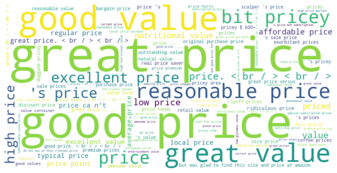

# Strategic Showcase: Leveraging Unsupervised Aspect Sentiment Analysis for Optimal Prime Day Product Selection

### Problem Statement  
In today's online retail environment, events like Prime Day create significant business value. Optimizing product recommendations for these events can drive better user experience and increase sales. Through the lens of unsupervised aspect-based sentiment analysis, this project aims to curate products that resonate best with customer sentiments, particularly concerning their price value perceptions.   

**Keywords**: Sentiment Analysis, Aspect-Based Analysis, Unsupervised Learning, Prime Day Optimization, Strategic 

